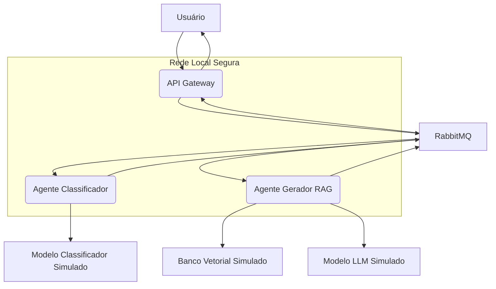

# RAG-Café: Sistema Distribuído de Suporte à Decisão na Cafeicultura

**Status:** Projeto desenvolvido para a disciplina de Sistemas Distribuídos — Graduação UFLA

---

## 📌 Visão Geral

O **RAG-Café** é um sistema distribuído projetado para auxiliar cafeicultores e agrônomos na tomada de decisão com base em conhecimento técnico-científico relevante.  
Ele utiliza microserviços e agentes de Inteligência Artificial (simulados) para responder perguntas complexas sobre cafeicultura, com base em uma base de conhecimento também simulada.

---

## 1️⃣ Problema (A “Dor”)

A cafeicultura moderna enfrenta desafios como:
- Mudanças climáticas
- Pragas e doenças
- Variações de mercado
- Otimização de insumos

Produtores precisam de informações **rápidas, confiáveis e contextualizadas**, mas a maior parte do conhecimento está fragmentada entre diversas fontes (artigos, boletins, manuais técnicos).

> O RAG-Café reduz a dependência de consultas manuais e da disponibilidade de especialistas.

---

## 2️⃣ Validação da Relevância

Instituições reforçam a necessidade de disseminar conhecimento técnico na cafeicultura:

- **EMBRAPA** – Boletins técnicos atualizados
- **UFLA** – Grande volume de pesquisa em cafeicultura
- **MAPA** – Diretrizes para adoção de melhores práticas
- **Consórcio Pesquisa Café** – Complexidade crescente na cultura

---

## 3️⃣ A Solução: RAG-Café

O sistema segue o conceito de **Retrieval-Augmented Generation (RAG)**:

1. O usuário envia uma pergunta pela API
2. O **Agente Classificador** identifica intenção e entidades
3. O **Agente Gerador RAG** busca informações relevantes na base simulada e retorna uma resposta
4. A resposta é devolvida ao usuário via API Gateway

📌 Técnicas de IA (classificação, busca vetorial e LLM) estão **simuladas**, com arquitetura pronta para futura integração real.

---

## 4️⃣ Arquitetura

Arquitetura distribuída baseada em microserviços com comunicação assíncrona via RabbitMQ:



---

## 5️⃣ Especificações Técnicas

| Item | Detalhes |
|------|----------|
| Linguagem | Python 3.11 |
| API | FastAPI |
| Comunicação A2A | RabbitMQ (RPC) |
| Containerização | Docker + Docker Compose |
| Segurança API | API-Key + Rate Limiting |
| Agentes | 2 microserviços simulando IA |
| Controle de Versão | GitHub |

---

## 6️⃣ Segurança

Mitigações aplicadas (modelo **STRIDE**):

✔ Rate Limiting (SlowAPI)  
✔ Autenticação via API Key  
✔ Broker autenticado (user/senha)  
✔ Containers como usuário não-root  

Segurança extra (HTTPS, criptografia at-rest) documentada em `/docs`.

---

## 7️⃣ Como Rodar o Projeto

### ✅ Pré-requisitos
- Docker + Docker Compose
- Git

### ✅ Passos

```bash
git clone <https://github.com/rafa-rez/caf-cultura-agents.git>
cd <caf-cultura-agents>
docker-compose build
docker-compose up
```

Para parar:

```bash
docker-compose down
```

---

## 8️⃣ Como Testar

### Envio de pergunta (ex.: via Postman ou curl)

**POST** → `http://localhost:8000/perguntar`

Headers:
```http
Content-Type: application/json
X-API-Key: cafe_seguro_UFLA_2025
```

Body:
```json
{
  "texto_pergunta": "Como combater a broca do café?"
}
```

### Testes de Segurança
- ❌ remover API Key → deve retornar **401**
- 🚨 enviar várias requisições rápidas (+10) → deve retornar **429**

---

## 9️⃣ Estrutura do Projeto

```
/
├─ api_gateway/
├─ agente_classificador/
├─ agente_rag/
├─ docs/
├─ docker-compose.yml
├─ .gitignore
└─ README.md
```

---

## 🔟 Documentação Arquitetônica

Arquivos na pasta `/docs`:
- Modelo inicial
- Modelagem STRIDE
- Arquitetura final com mitigação

---

## 1️⃣1️⃣ Membros do Grupo

- [Rafael Rezende]
- [Frederico Maia]
- [Mateus Mendes]

---

✅ Projeto pronto para integração com agentes reais de IA no futuro.
