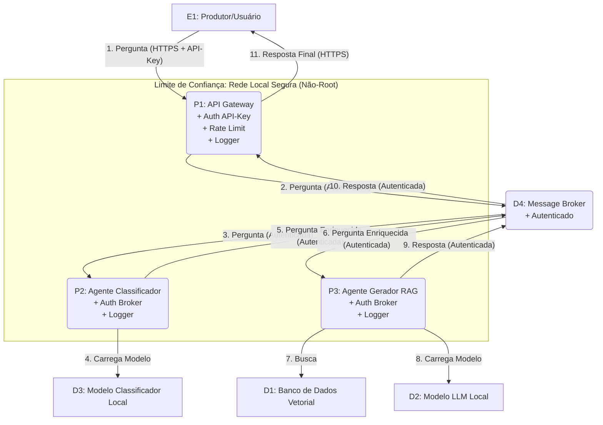

# Visão Arquitetônica Final - RAG-Café (Pós-Mitigação)

Este documento descreve a arquitetura final do sistema **RAG-Café**, detalhando as medidas de segurança implementadas com base na **Modelagem de Ameaças (STRIDE)**.

---

## 1. DFD Final (com Mitigações)

O DFD lógico permanece o mesmo da arquitetura inicial, mas agora os fluxos e processos são protegidos.

---

## 2. Resumo das Mitigações Implementadas

A tabela a seguir resume as ameaças e as soluções efetivamente implementadas no código-fonte.

| ID (Ameaça) | Mitigação Implementada | Artefatos Modificados |
|--------------|------------------------|------------------------|
| **T-01 (DoS)** | **Rate Limiting:** O API Gateway (P1) agora limita as requisições por IP a 10/minuto. | `api_gateway/main.py`, `api_gateway/requirements.txt` |
| **T-02 (Tampering)** | **Validação de Schema:** Mantido o uso de Pydantic no P1 para validar estritamente o JSON de entrada. | `api_gateway/main.py` |
| **T-04 (Spoofing)** | **Autenticação de API:** O P1 agora exige um header `X-API-Key` válido para todas as chamadas ao endpoint `/perguntar`. | `api_gateway/main.py` |
| **T-05 (Repudiation)** | **Logging Estruturado:** Todos os serviços (P1, P2, P3) foram migrados de `print()` para o módulo `logging` do Python. | `api_gateway/main.py`, `agente_classificador/main.py`, `agente_rag/main.py` |
| **T-06 (Spoofing)** | **Autenticação no Broker:** O RabbitMQ agora possui usuário (`rag_user`) e senha. P1, P2 e P3 usam essas credenciais. | `docker-compose.yml`, `main.py` (P1, P2 e P3) |
| **T-07 (EoP)** | **Containers Não-Root:** Todos os serviços agora rodam como `appuser` com privilégios mínimos. | `api_gateway/Dockerfile`, `agente_classificador/Dockerfile`, `agente_rag/Dockerfile` |

---

## 3. Mitigações Documentadas (Não Implementadas)

As seguintes ameaças foram tratadas em nível de **documentação**, pois exigem ferramentas externas ao escopo da aplicação (como proxies reversos ou configurações de cloud).

| ID (Ameaça) | Mitigação Proposta (Solução) |
|--------------|------------------------------|
| **T-03 (Info Disclosure)** | **HTTPS (SSL/TLS):** Em produção, o P1 (API Gateway) não seria exposto diretamente. Um Proxy Reverso (NGINX ou Traefik) gerenciaria o certificado SSL/TLS e forçaria o uso de HTTPS. |
| **T-08 (Info Disclosure)** | **Criptografia em Repouso:** A proteção dos dados no D1 (Banco Vetorial) seria feita ativando a criptografia *at-rest* no próprio serviço (ex: AWS KMS, Azure Key Vault ou `cryptfs` no servidor). |
